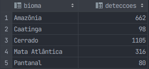
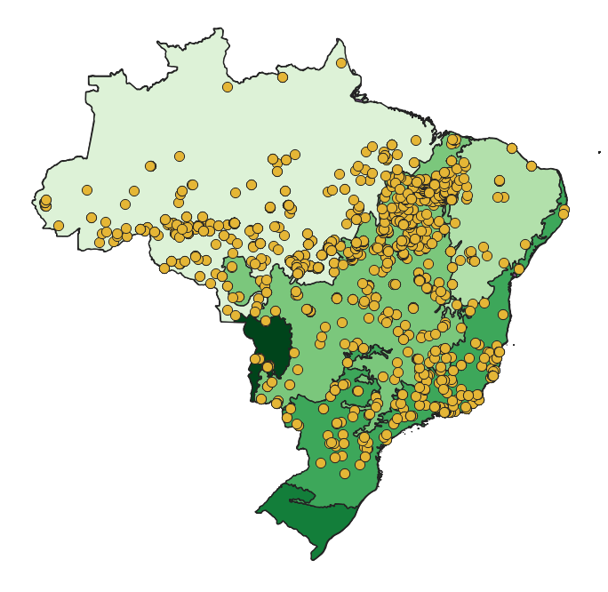

# PostGIS

## Dados dos focos de calor:
[Fire Information for Resource Management System](https://firms.modaps.eosdis.nasa.gov/active_fire/)

## Resultados da consulta espacial:

## Visualização dos dados no mapa
