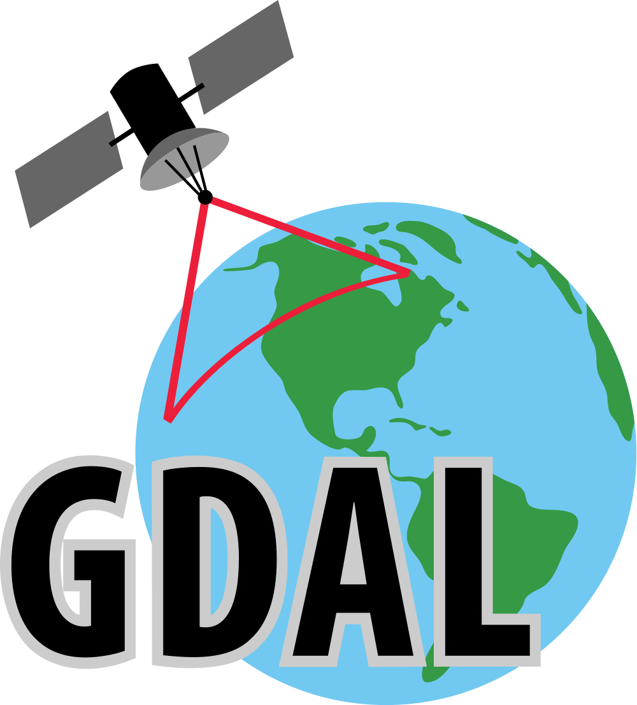

# Python: Exemplo de processamento de raster com GDAL

As imagens foram retiradas do satélite CBERS4A do sensor WPM.

---

Bibliotecas Necessárias para utilizar o script:
- GDAL

---
Detalhes do raster utilizado nesse exemplo:

- ID: CBERS4A_WPM_22912420210730
- Nome da coleção: CBERS4A_WPM_L4_DN
- Data: 30/07/2021
- Hora: 14:58:34
- Quantidade de nuvem: 0%
- Possui as Bandas: pan, vermelha, verde, azul, nir
- Órbida: 229
- Ponto: 124
- Satélite: CBERS4A
- Sensor: WPM

Obs1: Bandas vermelha, verde e azul possuem a resolução de 8 metros

Obs2: Banda panchromática possui a resolução de 2 metros

---

## Visualizando a extensão do raster:

## Área escolhida para o recorte

## Imagens recortadas

### Banda Vermelha (B3)

### Banda Verde (B2)

### Banda Azul (B1)

## Resultados do processamento

### Composição TRUE COLOR (B3, B2, B1) (Merge)

### Fusão da imagem TRUE COLOR com a banda Pan (Pansharpening)

