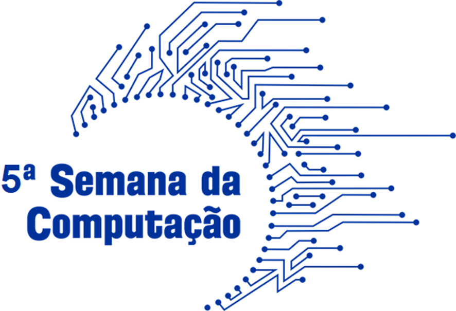
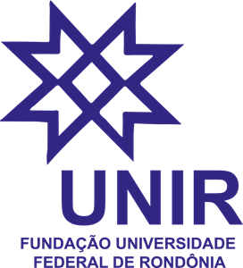
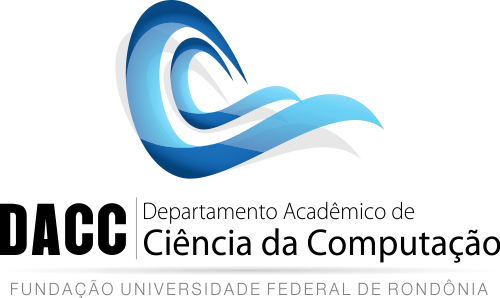

# 5° Edição - Semana da Computacao UNIR

    

## Palestra sobre: Potencialidades computacionais aplicado a satélites de observação da terra: Uma visão para serviços na Amazônia
Nesse repositório você encontra os códigos usados na apresentação.

### Palestrantes:
- Henrique Bernini ( [lattes](http://lattes.cnpq.br/1466550488753381) | [facebook](https://www.facebook.com/henrique.bernini) )
- Gabriel Russo ( [lattes](http://lattes.cnpq.br/2648730619472414) | [github](https://www.github.com/gabriel-russo) )

## Realização

    
    

